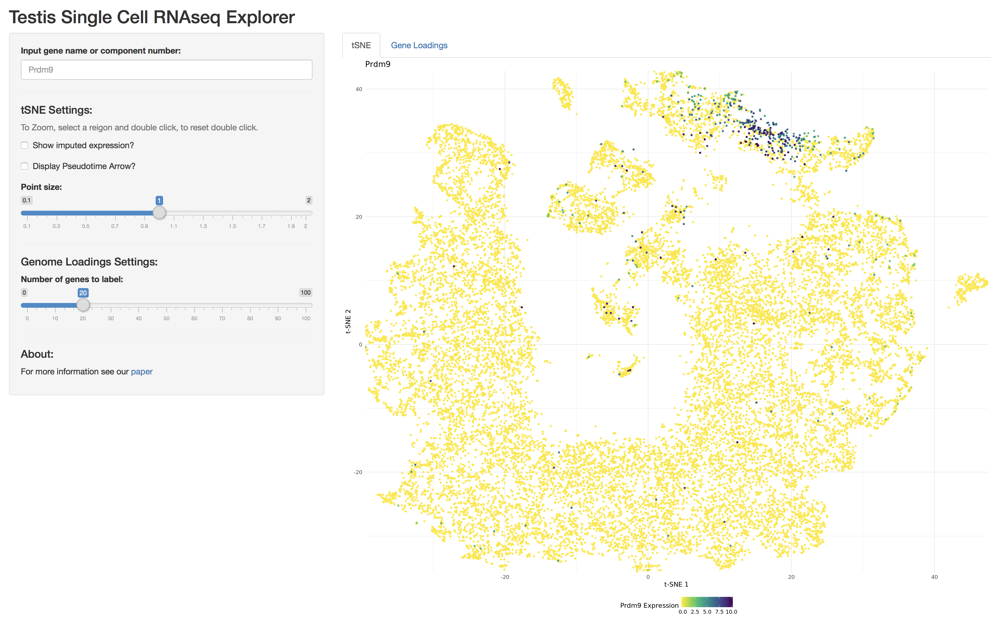
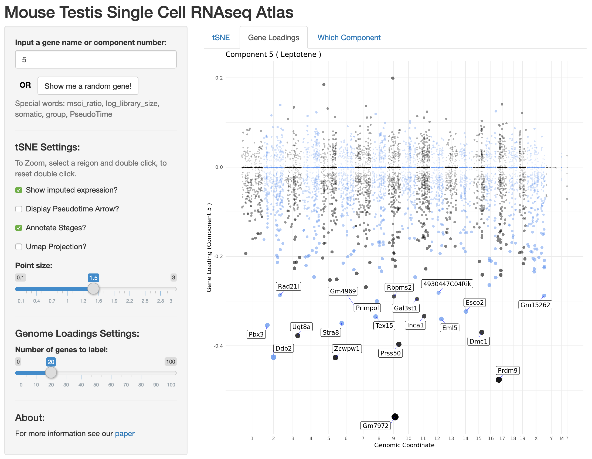

# Testis Atlas Shiny Web App

This is an interactive Shiny app which allows users to explore gene expression in the mouse testis for their genes of interest.

You can see the app running at http://www.stats.ox.ac.uk/~wells/testisAtlas.html

This repository enables you to run this Shiny App on your own computer/server when this url dies.




The following is a guide on how to run this app either on your personal computer or on a webserver.


# Quick Start on Local Machine

```{r}
# download shiny app code
git clone --depth=1 https://github.com/MyersGroup/testisAtlas.git
cd testisAtlas

# start R
R

# install dependencies
install.packages(c('shiny', 'ggplot2', 'data.table', 'viridis', 'remotes', 'bigmemory','shinycssloaders'), repos='http://cran.rstudio.com/')
remotes::install_github(c('myersgroup/testisAtlas'))
remotes::install_github('eliocamp/ggnewscale', ref='e3fee0106c')

# download data
download.file("https://zenodo.org/record/3233870/files/SDA_objects.zip", "SDA_objects.zip")
unzip("SDA_objects.zip", exdir="shinyApp/cache")

# run the shiny app
shiny::runApp("shinyApp")
```


# Running the app on a web-server

## Low Memory Mode (default: Off)


For running this app on a memory constrained machine (e.g. a free-tier 1GB RAM t2.micro AWS server) set the option to TRUE at the top of the file `app.R`.

```{r}
low_memory_mode = TRUE
```

In low memory mode, the data for each gene will be stored on disk and read when requested by the end user.
To use low memory mode, the script `setup_low_memory_mode.R` must be run first.

```{r}
Rscript setup_low_memory_mode.R
```

Note that this step must itself be done on a *high* memory machine, so if setting up an AWS instance, choose t2.large so you have 8GB RAM. Then you can stop the instance and change the type back to t2.micro.


## Possible Hosting Companies

The app can be run on an Amazon Web Services web server (EC2 VPC instance). Anyone with an internet connection can then interact with the App. AWS enables more flexibility than shinyapps.io in that you can set password authentication (e.g. for pre-publication / private release) and custom domains for much less than the $1,100/year or $3,300/year respectively that would be required for this functionality in shinyapps.io.

As of June 2018 AWS EC2 pricing is as follows:

- A) $0.0126 per hour for t2.micro (1 GiB RAM & 1 vCPU) = $110.37 per year
- B) $0.025 per hour for for t2.small (2 GiB RAM & 1 vCPU) = $219 per year
- C) $0.05 per hour for t2.medium (4 GiB RAM & 2 vCPU) = $438 per year

Option A is equivalent to shinyapps.io "Starter" package price. On AWS it is 'free tier eligible' so actually free for the first year, and $100 of educational credit is available with AWS.
Option C is equivalent to shinyapps.io "Basic" package which has 8GB of RAM, rather than the max of 1GB the "Starter" package is limited to.

Based on the authentication possibility and slightly favourable pricing of AWS I chose that.

## Setting up an AWS instance

To set up an instance log in to the AWS dashboard. Go to EC2 > Launch Instance.
Choose "Ubuntu Server 18.04 LTS (HVM), SSD Volume Type" (or My AMI if you've already done this and saved an image).
Chose the default options but for the security group use: 

```
HTTP	TCP	80	0.0.0.0/0
SSH	TCP	22	<ENTER YOUR LOCAL COMPUTER IP HERE>
Custom TCP Rule	TCP	3838	0.0.0.0/0
```

Then launch the instance.

To create a stable IP address, go to "Elastic IPs" section and allocate a new address and assign it to the instance you just created. (This is free as long as the Elastic IP is assigned).

You can log into the instance with:
```{bash}
chmod 400 your_private_key_here.pem
ssh -i "your_private_key_here.pem" ubuntu@ec2-<YOUR PUBLIC DNS ADDRESS HERE>.eu-west-1.compute.amazonaws.com
```

## Install the required software

```{bash}

# Update Ubuntu
sudo add-apt-repository ppa:marutter/rrutter3.5
sudo apt-get update
sudo apt-get -y install \
     gdebi-core \
     r-base \
     libcurl4-openssl-dev \
     libxml2-dev \
     libssl-dev \
     libcurl4-gnutls-dev \
     libcairo2-dev \
     libgdal-dev \
     libgeos-dev \
     libproj-dev \
     libxml2-dev \
     libxt-dev \
     libv8-dev
 
wget https://download3.rstudio.org/ubuntu-14.04/x86_64/shiny-server-1.5.9.923-amd64.deb
sudo gdebi shiny-server-1.5.9.923-amd64.deb

# install CRAN hosted repositories
sudo su - -c "R -e \"install.packages(c('shiny', 'ggplot2', 'data.table', 'viridis', 'remotes', 'bigmemory','shinycssloaders'), repos='http://cran.rstudio.com/')\""

# the following are required for the scales package which is a dependency of SDAtools
sudo add-apt-repository ppa:ubuntugis/ubuntugis-unstable --yes
sudo apt-get --yes --force-yes update -qq
sudo apt-get install -y libudunits2-dev libgeos++-dev

# install github hosted packages
sudo su - -c "R -e \"remotes::install_github(c('myersgroup/testisAtlas'))\""
sudo su - -c "R -e \"remotes::install_github('eliocamp/ggnewscale', ref='e3fee0106c')\""
```

## Download the shiny app files

```{bash}

sudo chmod 777 /srv/shiny-server
cd /srv/shiny-server/

git clone --depth=1 https://github.com/MyersGroup/testisAtlas.git
cd testisAtlas

wget https://zenodo.org/record/3233870/files/SDA_objects.zip
unzip SDA_objects.zip -d shinyApp/cache
```

```{bash}
sed -i 's/low_memory_mode = FALSE/low_memory_mode = TRUE/g' shinyApp/app.R
cd shinyApp
Rscript setup_low_memory_mode.R
```

# Point shiny-server to the app

```{bash}
sudo systemctl stop shiny-server
sudo nano /etc/shiny-server/shiny-server.conf

# add /testisAtlas/shinyApp to site_dir
sudo systemctl start shiny-server
```

Done!