testisAtlas: Vignette (Tutorial)
================
Daniel Wells
2020-01-25

This tutorial guides you through how to use the testisAtlas package to
explore the single cell RNAseq data from mice testis from our
publication. If you just want the QC counts data to explore with your
own functions you can find it [on
Zenodo](https://zenodo.org/record/3233870).

Download the data
(250MB)

``` r
download.file("https://zenodo.org/record/3233870/files/SDA_objects.zip", "SDA_objects.zip")
unzip("SDA_objects.zip", exdir="SDA_Objects")
```

Install (if not allready) & load

``` r
# remotes::install_github("myersgroup/testisAtlas")
library(testisAtlas)
```

    ## Loading testisAtlas

``` r
load2("SDA_Objects") # convenience function to load all rds objects in a folder
load_component_orderings()
```

Inspect the top genes for a given component (with
    metadata):

``` r
gene_list(5, n=5)
```

    ##    gene_symbol Human_Orthologue   Loading Infertility_Gene Testis_Enriched
    ## 1:      Gm7972             <NA> -0.559250               NA              NA
    ## 2:       Prdm9            PRDM9 -0.475946             TRUE            TRUE
    ## 3:      Zcwpw1           ZCWPW1 -0.426587            FALSE            TRUE
    ## 4:        Ddb2             DDB2 -0.425611            FALSE           FALSE
    ## 5:      Prss50           PRSS50 -0.396677            FALSE            TRUE
    ##    fold_enrichment_gtex fold_enrichment_fantom chromosome_name
    ## 1:                   NA                     NA               9
    ## 2:            8.1790000                  0.222              17
    ## 3:            9.1540688                  1.430               5
    ## 4:            0.2635425                  0.250               2
    ## 5:            2.3779343                  2.800               9
    ##    start_position
    ## 1:       75468616
    ## 2:       15543079
    ## 3:      137787798
    ## 4:       91211572
    ## 5:      110857967

Plot gene expression or cell scores in tSNE space:

``` r
print_tsne("Prdm9")
```

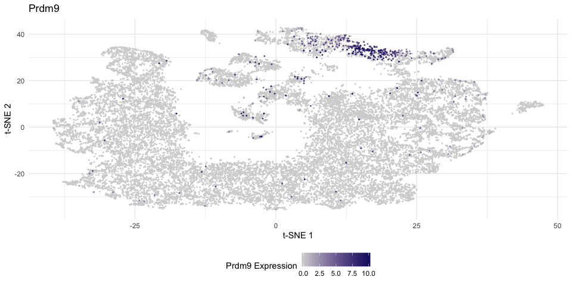<!-- -->

``` r
print_tsne(5) # component 5 cell scores
```

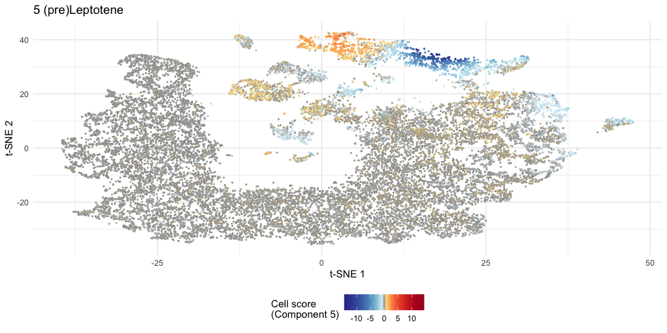<!-- -->

Use the predict argument to use SDA imputed expression values.
Internally calls the sda\_predict() function.

``` r
print_tsne("Prdm9", predict = T)
```

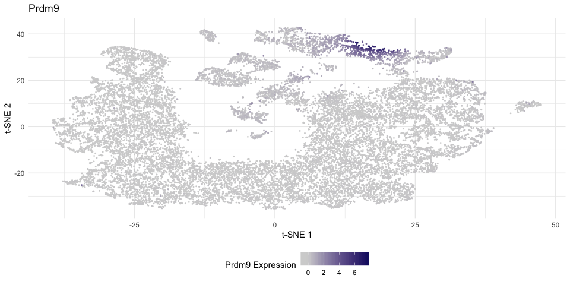<!-- -->

By default the axes are tSNE coordinates, but you can use any column in
cell\_data using the dim1/2 arguments, for example to use UMAP
projection or to plot components by
e.g. pseudotime:

``` r
print_tsne("Prdm9", dim1 = "Umap1", dim2 = "Umap2")
```

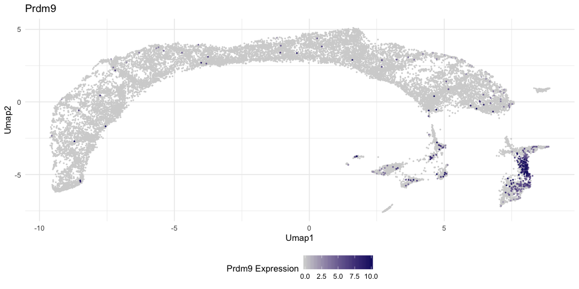<!-- -->

``` r
print_tsne("Zfy2", dim1 = "msci_ratio", dim2 = "V38", predict = T)
```

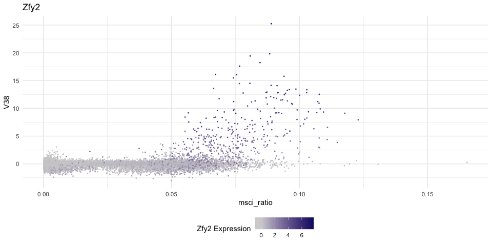<!-- -->

``` r
print_tsne("Ssxb1", dim1 = "PseudoTime", dim2 = "V42", predict = T) + scale_y_reverse() + scale_x_reverse() 
```

    ## Warning: Removed 3417 rows containing missing values (geom_point).

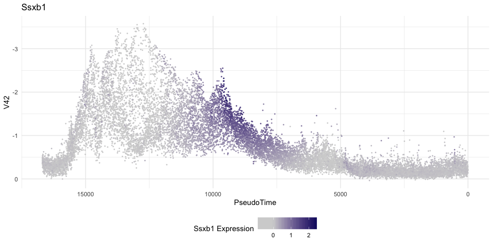<!-- -->

To plot multiple gene expressions on a single tSNE there’s a seperate
function:

``` r
tricolour_tsne(c("Prdm9","Esx1","Piwil1"))
```

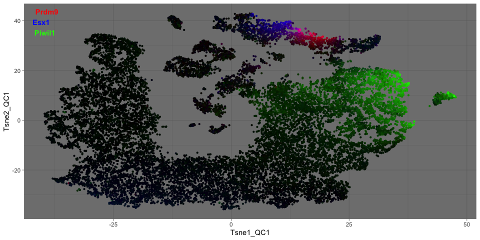<!-- -->

To get imputed expression with pseudotime/Tsne/experiment information
use the melt\_genes() function:

``` r
tmp <- melt_genes(c("Prdm9","Ssxb1"), predict = T)

ggplot(tmp, aes(-PseudoTime, Expression)) +
  geom_point(stroke=0, size=1, alpha=0.3) +
  facet_wrap(~Gene) +
  theme_minimal()
```

    ## Warning: Removed 6834 rows containing missing values (geom_point).

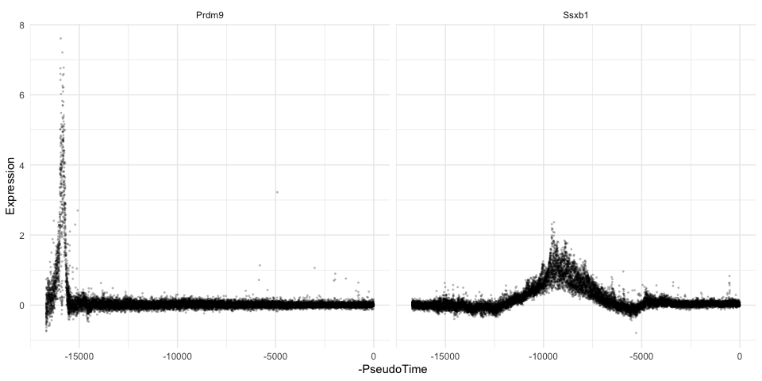<!-- -->

Visualise gene loadings in a manhatten style
plot:

``` r
genome_loadings(SDAresults$loadings[[1]][5,], gene_locations = gene_annotations)
```

    ## Using mmusculus_gene_ensembl chromosome lengths

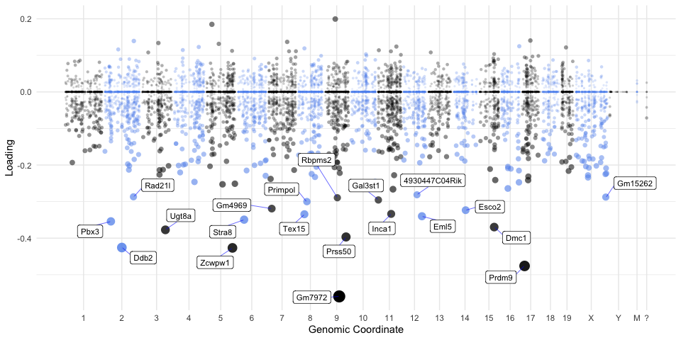<!-- -->

Which components have the highest loading for gene X:

``` r
highest_components(SDAresults, "Prdm9")
```

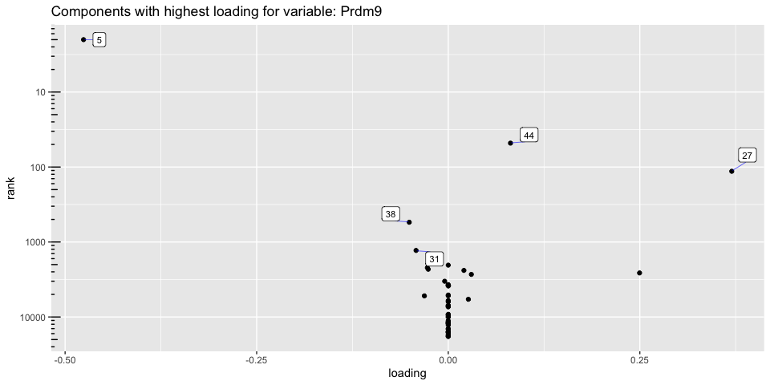<!-- -->

Plot component scores by experimental group:

``` r
plot_cell_scores("V38", point_size = 2)
```

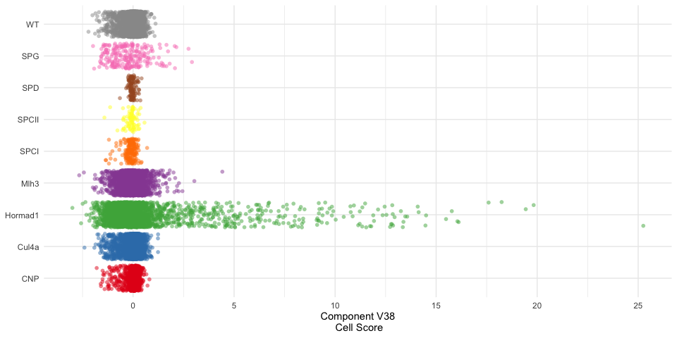<!-- -->

Check (precomputed) Gene Ontology enrichments for a component:

``` r
head(GO_enrich[Component=="V30P"])
```

    ##            ID
    ## 1: GO:0016998
    ## 2: GO:0044036
    ## 3: GO:0071554
    ## 4: GO:0007338
    ## 5: GO:0009566
    ## 6: GO:0007342
    ##                                                                Description
    ## 1:                               cell wall macromolecule catabolic process
    ## 2:                               cell wall macromolecule metabolic process
    ## 3:                                    cell wall organization or biogenesis
    ## 4:                                                    single fertilization
    ## 5:                                                           fertilization
    ## 6: fusion of sperm to egg plasma membrane involved in single fertilization
    ##    GeneRatio   BgRatio       pvalue     p.adjust       qvalue
    ## 1:     8/226  10/14566 1.300596e-13 1.469673e-10 1.469673e-10
    ## 2:     8/226  11/14566 4.705388e-13 1.772363e-10 1.772363e-10
    ## 3:     8/226  11/14566 4.705388e-13 1.772363e-10 1.772363e-10
    ## 4:    16/226 108/14566 9.543034e-12 2.695907e-09 2.695907e-09
    ## 5:    17/226 147/14566 1.209353e-10 2.733138e-08 2.733138e-08
    ## 6:     6/226  12/14566 1.116134e-08 2.102052e-06 2.102052e-06
    ##                                                                                                          geneID
    ## 1:                                                  Spaca1/Lyzl6/Spaca3/Lyzl1/Lyzl4/Spaca7/Spaca4/1700016D06Rik
    ## 2:                                                  Spaca1/Lyzl6/Spaca3/Lyzl1/Lyzl4/Spaca7/Spaca4/1700016D06Rik
    ## 3:                                                  Spaca1/Lyzl6/Spaca3/Lyzl1/Lyzl4/Spaca7/Spaca4/1700016D06Rik
    ## 4:       Spata46/Lyzl6/Spaca3/Cast/Spam1/Lyzl4/Fam170b/Spaca7/Zp3r/Eqtn/Glipr1l1/Adam24/Hyal5/Izumo1/H3f3b/Zpbp
    ## 5: Spata46/Lyzl6/Spaca3/Cast/Spam1/Lyzl4/Fam170b/Spaca7/Zp3r/Eqtn/Glipr1l1/Tekt4/Adam24/Hyal5/Izumo1/H3f3b/Zpbp
    ## 6:                                                                        Spata46/Lyzl6/Spam1/Eqtn/Hyal5/Izumo1
    ##    Count Enrichment   GeneOdds       BgOdds Component
    ## 1:     8  51.561062 0.03669725 0.0006870019      V30P
    ## 2:     8  46.873693 0.03669725 0.0007557540      V30P
    ## 3:     8  46.873693 0.03669725 0.0007557540      V30P
    ## 4:    16   9.548345 0.07619048 0.0074699129      V30P
    ## 5:    17   7.453555 0.08133971 0.0101948818      V30P
    ## 6:     6  32.225664 0.02727273 0.0008245156      V30P

``` r
go_volcano_plot("V30P", top_n = 10)
```

    ## Warning: Removed 565 rows containing missing values (geom_point).

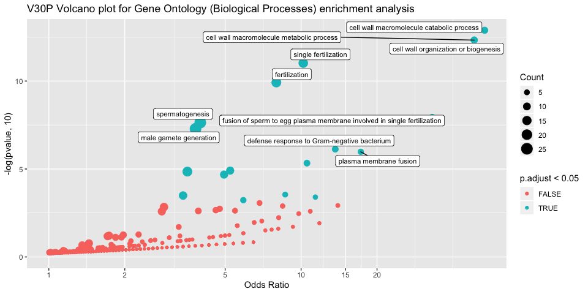<!-- -->

Test all components for enrichment of a custom gene list:

``` r
gene_list <- c("Prdm9","Zcwpw1","Meiob","Dmc1","Esx1")
tmp <- component_enrichment(gene_list)
tmp[order(p.value)][1:5]
```

    ##    component      p.value        OR hits               hit_names
    ## 1:        5N 2.197426e-06 150.97100    4 Prdm9,Zcwpw1,Dmc1,Meiob
    ## 2:        2P 1.672239e-04  56.54825    3       Zcwpw1,Meiob,Dmc1
    ## 3:       37N 1.672239e-04  56.54825    3       Zcwpw1,Dmc1,Meiob
    ## 4:       38N 1.672239e-04  56.54825    3      Zcwpw1,Meiob,Prdm9
    ## 5:       13P 6.383884e-03  25.08346    2              Meiob,Dmc1
    ##                      name rank    Type
    ## 1:         (pre)Leptotene   56 Meiotic
    ## 2:        B Spermatogonia   51 Meiotic
    ## 3:   Sertoli (Trim7 High)   18 Somatic
    ## 4: X activation (Hormad1)   60 Meiotic
    ## 5:      Early Pachytene 1   65 Meiotic

``` r
manhatten_plot(tmp)
```

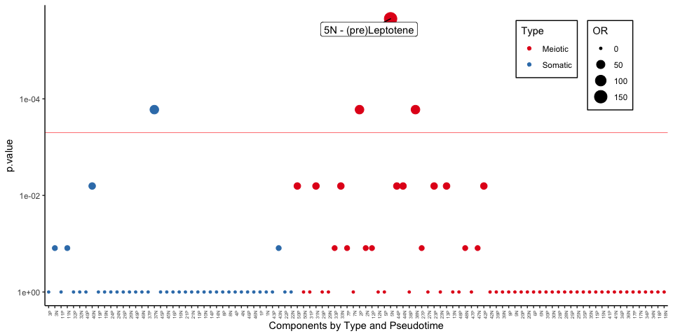<!-- -->
